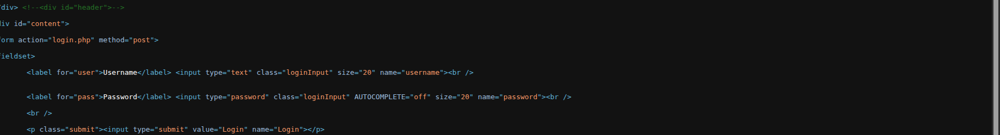
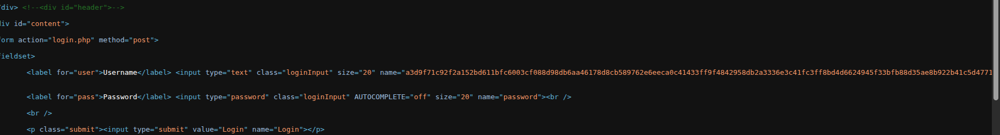

# KB: 1080

---

## Configuring Tamper Rules to Prevent Man-in-the-Middle (MITM) Attacks

This document explains how to configure **Tamper Rules** in the WAF to protect application parameters from manipulation and thereby mitigate **Man-in-the-Middle (MITM)** attacks.

---

## Problem Statement

Web applications that process sensitive user input, such as authentication parameters, are susceptible to **Man-in-the-Middle (MITM) attacks** when request integrity is not enforced. In such scenarios, an attacker positioned between the client and the server may intercept and modify HTTP request bodies to manipulate critical parameters (for example, login credentials).

To address this risk, the WAF must enforce **parameter protection and attribute validation** to ensure that request data cannot be tampered with during transit. By validating both the parameter name and its value across all URIs and HTTP methods, unauthorized modifications or abnormal injections—commonly associated with MITM activity—can be detected and blocked. This preserves request integrity and prevents unauthorized access to the application.

---

## Solution

### 1. Configure Tamper Rules

Navigate to **Tamper Rules** in the WAF.  
Refer to the documentation to understand the configuration in detail: [**Tamper Rules Configuration Guide**](../../enterprise/waf/listener/profiles/rules/tamper_rules.md)

Configure the rule as shown below:

---

### 2. Configure Encryption / Secret Key

Ensure that a **secret encryption key** is configured to enhance the security of the tamper protection mechanism.

---

### 3. Update Security Settings

Add the previously created encryption key under the **Security Settings** section and enable client-side protection.

---

## Observation

### Before Configuration

Before applying the tamper rule configuration, the application request parameters appear in plain and predictable form, making them susceptible to interception and manipulation.

---

### After Configuration

After configuring the tamper rule and security settings, sensitive parameters are protected and appear in an encoded or secured form, preventing attackers from modifying them during transit.

---

## Conclusion

By implementing Tamper Rules along with encryption and security settings, the WAF effectively protects sensitive request parameters from in-transit manipulation. This configuration significantly reduces the risk of Man-in-the-Middle attacks by ensuring parameter integrity, detecting unauthorized modifications, and blocking malicious requests before they reach the application.

---

## Summary

- Prevents parameter tampering during transit  
- Mitigates Man-in-the-Middle (MITM) attack risks  
- Enforces strict attribute extraction and validation  
- Enhances application security using encryption keys  
- Preserves request integrity across all URIs and HTTP methods  

---

